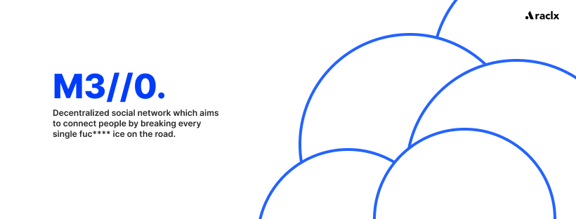

Social Network plaform that aims to connect right people with right people, without matter of purpose of connection (business, friends or dating) - we're
builing an one big-ass icebreaker for everything.

## About Mello & Araclx, Inc

Jay have founded Mello cause one single reason - "I don't know how to find gf" that's makes him an extreme looser and degenrate. (like an whole Araclx, Inc
tho). The main idea behind mello is to remove limits associated with social networks. Personally we're sure connections in our world should be direct without
wasting time on people that bascially aren't in your type or doesn't have any valule.

Actually in this project we don't give an signle fuck about valuation, monetization and other kind of financial crap because Qhfte (another shitty product of
Araclx, Inc) is funding everything at all.

## Usage

**You don't lmao**

## Documentation

**Docu... What?**

## Contributing

**You don't**

## License

[MIT](./LICENSE) @ Araclx, Inc.
